# Бизнес-логика программных систем

> Выполнил: Герасимов Артём Кириллович  
> Группа: P33111  
> Преподаватель: Егошин Алексей Васильевич

## Лабораторная работа №1

**Вариант №1104:** Туристер - <http://tourister.ru>

Описать бизнес-процесс в соответствии с нотацией BPMN 2.0, после чего реализовать его в виде приложения на базе Spring Boot.

**Порядок выполнения работы:**

1. Выбрать один из бизнес-процессов, реализуемых сайтом из варианта задания.
2. Утвердить выбранный бизнес-процесс у преподавателя.
3. Специфицировать модель реализуемого бизнес-процесса в соответствии с требованиями BPMN 2.0.
4. Разработать приложение на базе Spring Boot, реализующее описанный на предыдущем шаге бизнес-процесс. Приложение должно использовать СУБД PostgreSQL для хранения данных, для всех публичных интерфейсов должны быть разработаны REST API.
5. Разработать набор curl-скриптов, либо набор запросов для REST клиента Insomnia для тестирования публичных интерфейсов разработанного программного модуля. Запросы Insomnia оформить в виде файла экспорта.
6. Развернуть разработанное приложение на сервере **_helios_**.

## Лабораторная работа №2

**Вариант №1145**

Доработать приложение из **лабораторной работы №1**, реализовав в нём управление транзакциями и разграничение доступа к операциям бизнес-логики в соответствии с заданной политикой доступа.

**Управление транзакциями необходимо реализовать следующим образом:**

1. Переработать согласованные с преподавателем прецеденты (или по согласованию с ним разработать новые), объединив взаимозависимые операции в рамках транзакций.
2. Управление транзакциями необходимо реализовать с помощью Spring JTA.
3. В реализованных (или модифицированных) прецедентах необходимо использовать **декларативное управление транзакциями**.
4. В качестве менеджера транзакций необходимо использовать **Atomikos**.

**Разграничение доступа к операциям необходимо реализовать следующим образом:**

1. Разработать, специфицировать и согласовать с преподавателем набор привилегий, в соответствии с которыми будет разграничиваться доступ к операциям.
2. Специфицировать и согласовать с преподавателем набор ролей, осуществляющих доступ к операциям бизнес-логики приложения.
3. Реализовать разработанную модель разграничений доступа к операциям бизнес-логики на базе **Spring Security**. Информацию об учётных записях пользователей необходимо **сохранять в реляционную базу данных**, для аутентификации использовать **HTTP basic**.

## Лабораторная работа №3

**Вариант №1168**

Доработать приложение из **лабораторной работы №2**, реализовав в нём асинхронное выполнение задач с распределением бизнес-логики между несколькими вычислительными узлами и выполнением периодических операций с использованием планировщика задач.

**Требования к реализации асинхронной обработки:**

1. Перед выполнением работы необходимо согласовать с преподавателем набор прецедентов, в реализации которых целесообразно использование асинхронного распределённого выполнения задач. Если таких прецедентов использования в имеющейся бизнес-процесса нет, нужно согласовать реализацию новых прецедентов, доработав таким образом модель бизнес-процесса из лабораторной работы #1.
2. Асинхронное выполнение задач должно использовать модель доставки **"подписка"**.
3. В качестве провайдера сервиса асинхронного обмена сообщениями необходимо использовать сервис подписки на базе **Apache Kafka + ZooKeeper**.
4. Для отправки сообщений необходимо использовать **Kafka Producer API**.
5. Для получения сообщений необходимо использовать **API KafkaConsumer (org.apache.kafka.clients.consumer.KafkaConsumer)**.

**Требования к реализации распределённой обработки:**

1. Обработка сообщений должна осуществляться на двух независимых друг от друга узлах сервера приложений.
2. Если логика сценария распределённой обработки предполагает транзакционность выполняемых операций, они должны быть включены в состав распределённой транзакции.

**Требования к реализации запуска периодических задач по расписанию:**

1. Согласовать с преподавателем прецедент или прецеденты, в рамках которых выглядит целесообразным использовать планировщик задач. Если такие прецеденты отсутствуют -- согласовать с преподавателем новые и добавить их в модель автоматизируемого бизнес-процесса.
2. Реализовать утверждённые прецеденты с использованием планировщика задач **Quartz**.

## Модель потока управления

## Спецификация REST API

| **Действие**                  | **Адрес**                                                    | **HTTP метод** | **Требуется роль** |
|:------------------------------|:-------------------------------------------------------------|:---------------|--------------------|
| Регистрация                   | `/auth/registration`                                         | POST           | -                  |
| Логин (получение CSRF-токена) | `/auth/login`                                                | GET            | -                  |
| Гиды в городе                 | `/guides?country=name&city=name`                             | GET            | -                  |
| Экскурсии в городе            | `/tours?country=name&city=name`                              | GET            | -                  |
| Информация о пользователе     | `/users/{username}`                                          | GET            | -                  |
| Экскурсии гида                | `/users/{username}/tours`                                    | GET            | -                  |
| Конкретная экскурсия гида     | `/users/{username}/tours/{id}`                               | GET            | -                  |
| Добавить экскурсию            | `/users/{username}/tours`                                    | POST           | GUIDE              |
| Заказы клиента                | `/users/{username}/orders`                                   | GET            | USER               |
| Конкретный заказ клиента      | `/users/{username}/orders/{id}`                              | GET            | USER               |
| Создать заказ                 | `/users/{username}/orders`                                   | POST           | USER               |
| Заказы для гида               | `/users/{username}/available-orders`                         | GET            | GUIDE              |
| Конкретный заказ для гида     | `/users/{username}/available-orders/{id}`                    | GET            | GUIDE              |
| Принять или отклонить заказ   | `/users/{username}/available-orders/{id}/?accepted=accepted` | PATCH          | GUIDE              |
| Выдача роли "Гид"             | `/users/{username}/add-privilege`                            | PATCH          | ADMIN              |
